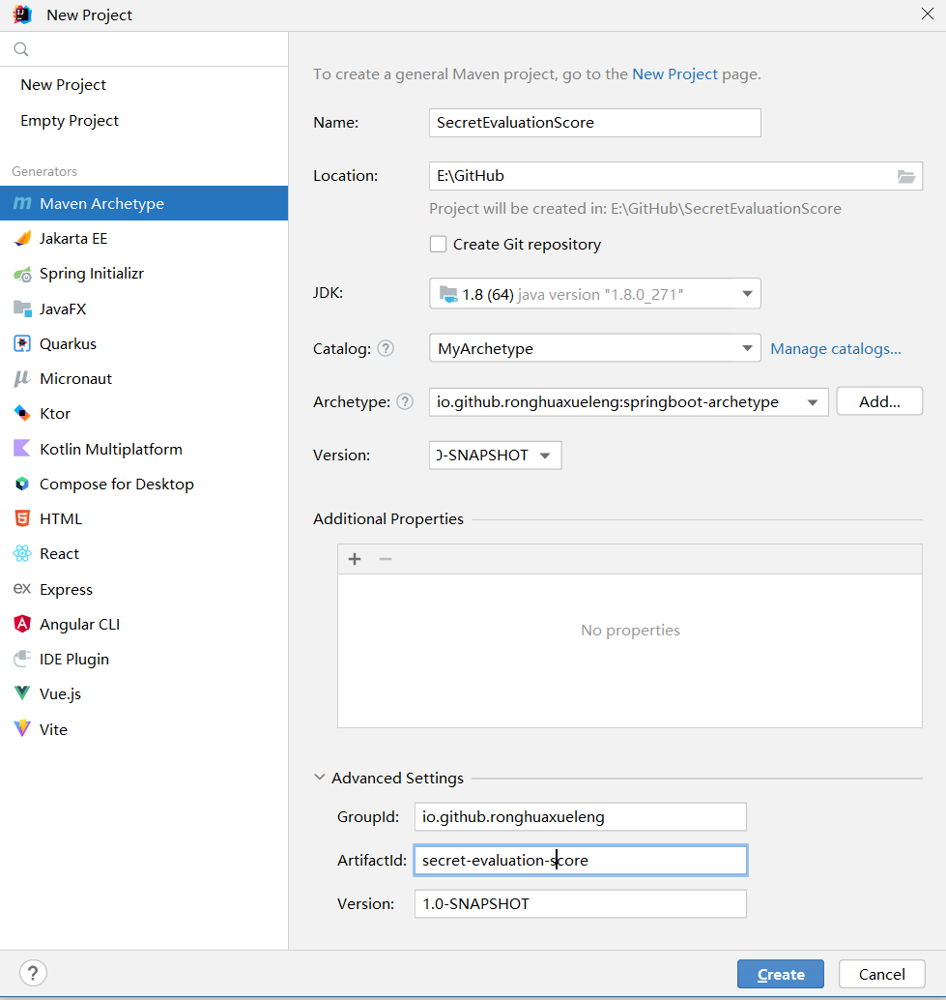
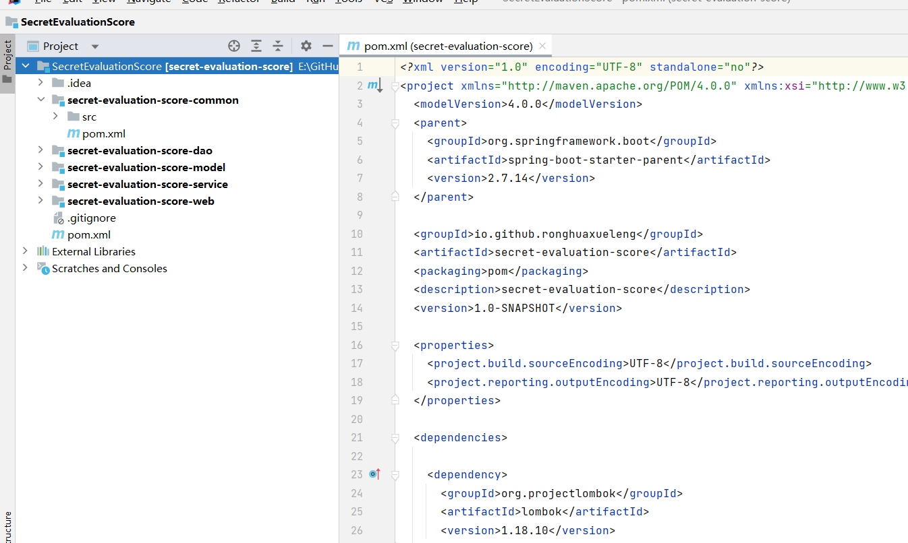

# SpringBoot Archetype

> Spring Boot Archetype 将帮助你快速生成 Spring Boot 项目。

## 注意！

* 不要直接运行本项目，本项目是制作`maven archetype模板`的模板
* 本项目依赖于 Lombok 插件，请在 IDE 中安装 `Lombok Plugin`，安装步骤请自行百度

## 前置条件

* [JDK 8](http://www.oracle.com/technetwork/java/javase/downloads/jdk8-downloads-2133151.html)
* [Maven 3](http://maven.apache.org/download.cgi)
* [Lombok](https://mp.weixin.qq.com/s?__biz=MzI0OTIzOTMzMA==&mid=2247483851&idx=1&sn=007ceceaa3a3e6fecbeb23873a230e19&chksm=e995c386dee24a90c9493949bd1cb159114f5d457d4354a93050c3a218c5d111a193406dff74&mpshare=1&scene=1&srcid=0606I1Vkahdws6aFa04Ytvpv#rd)

## 特点

* 基于 Spring Boot 2.2.2.RELEASE的多模块项目
* 提供全局异常捕获、跨域访问、对返回数据进行封装等功能
* 提供 Maven Profile 和 Spring Profile 完美融合的解决方案
* 支持docker部署
* 集成MyBatis、PageHelper
* 支持多数据源配置
* 使用FastJson替换Jackson进行JSON解析
* 支持出入参、持久化时枚举类型的转换

## 运行

### 创建模板

#### 第一步：将archetype打包发布到本地仓库

```shell
mvn clean install
```

从本地仓库删除

```
mvn dependency:purge-local-repository -DmanualInclude="com.jzdata:springboot-archetype"
```


#### 第二步：生成Catalog文件

Catalog文件中包含了所有的Archetype，可以用来展示本地仓库中所有可以使用的archetype

```shell
mvn archetype:crawl
```

到此为止，项目模板就制作完成了，下面是使用方法

### 生成目标项目结构

#### 方法一：直接指定好参数

| 参数                | 描述                    | 默认值       |
| ------------------- | ----------------------- | ------------ |
| archetypeGroupId    | 模板GroupId             | 无           |
| archetypeArtifactId | 模板ArtifactId          | 无           |
| archetypeVersion    | 模板版本                | 1.0-SNAPSHOT |
| archetypeCatalog    | 插件默认的catalog的路径 | 无           |
| interactiveMode     | 是否以交互的方式生成    | true         |
| groupId             | 目标项目GroupId         | 无           |
| artifactId          | 目标项目ArtifactId      | 无           |
| version             | 目标项目版本            | 无           |
| package             | 目标项目根包名          | 无           |


```shell
mvn archetype:generate -DarchetypeGroupId=com.jzdata -DarchetypeArtifactId=springboot-archetype -DinteractiveMode=false -DarchetypeCatalog=local -DgroupId=com.test -DartifactId=test -Dversion=${version} -Dpackage=com.test
```

#### 方法二：交互方式

```shell
mvn archetype:generate -DarchetypeCatalog=local
```

插件默认的catalog的路径为remote,local，即远程仓库和本地仓库的，为了构建的速度，直接将catalog的路径设置为本地仓库

控制台输出：

```shell
Choose archetype:
1: local -> com.jzdata:springboot-archetype (springboot)
2: local -> org.apache.maven.archetypes:maven-archetype-quickstart (quickstart)
Choose a number or apply filter (format: [groupId:]artifactId, case sensitive contains): 2:
```

在这里进行archetype的选择，选择完成后就是输入定义的参数，构建成功之后就可以用了

#### 方法三：使用IDEA

**第一步：File->New->Project...**


**第二步：选择创建的maven模板**




**第三步：填写项目基本信息**


完成以上的步骤之后，项目就创建完成了，项目结构如下：

